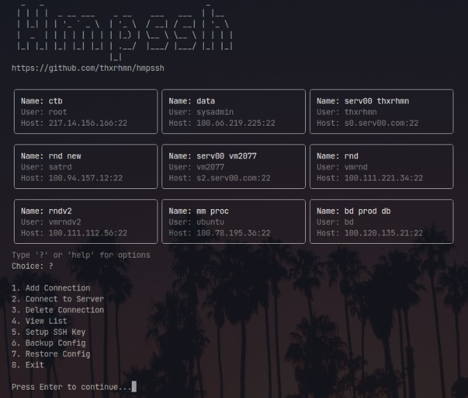

# Hmpssh - Highly Minimal & Practical SSH Handler



Hmpssh is a terminal-based SSH connection management application written in Go. This application is designed to be minimalist, practical, and easy to use, with essential features such as connection management, configuration backup, and SSH key settings.

## Features

- **Add SSH Connection**: Add a new connection with a name, username, host, and port.
- **Connect to Server**: Select and connect to a server from the connection list.
- **Delete Connection**: Delete a connection that is no longer needed.
- **Connection List**: Display all connections in a neat and responsive format.
- **SSH Key Settings**: Create and copy SSH keys to the server.
- **Configuration Backup**: Create a backup of the configuration in tar.gz format.
- **Restore Configuration**: Restore the configuration from a backup file.
- **Minimalist Interface**: Uses a simple text style with basic color support.

## Prerequisites

- **Go**: Version 1.20 or higher to build the application.
- **SSH Tools**: Ensure `ssh`, `ssh-keygen`, `ssh-copy-id`, and `tar` are available on your system.

## Installation

1. Clone this repository:

   ```bash
   git clone https://github.com/thxrhmn/hmpssh.git
   cd hmpssh
   ```

2. Install dependencies:

   ```bash
   go mod tidy
   ```

3. Build the application:

   ```bash
   go build -o hmpssh
   ```

4. Run:

   ```bash
   ./hmpssh
   ```

## Usage

After running the application, you will see a list of connections (if any) and a prompt to select an option. Type the option number or the following commands:

- `?` or `help`: Display the list of options.
- `1`: Add a new connection.
- `2`: Connect to a server.
- `3`: Delete a connection.
- `4`: View the connection list.
- `5`: Set up SSH keys.
- `6`: Create a configuration backup.
- `7`: Restore the configuration from a backup.
- `8`: Exit the application.

### Examples

1. **Adding a Connection**:

   ```bash
   Choice: 1
   Connection Name: myserver
   Username: user
   Host (IP or domain): example.com
   Port (default 22): 22
   Setup SSH key now? (y/n): y
   ```

2. **Connecting to a Server**:

   ```bash
   Choice: 2
   Select a server to connect (enter the number):
   [0] myserver (user@example.com)
   Choice: 0
   ```

## File Structure

- **Config File**: Saved in `~/.ssh/connections.conf`.
- **SSH Key**: Default in `~/.ssh/id_rsa`.
- **Backup**: Saved in `~/ssh_backup/ssh_config_backup_<timestamp>.tar.gz`.

## Notes

- This application uses a minimalist color scheme (white, gray, black) for the terminal interface.
- Ensure the `~/.ssh` directory and configuration file permissions are correct (0700 for directories, 0600 for files).
- It is recommended to move backups to another device for security.

## Contribution

Feel free to fork this repository and send a pull request for improvements or new features. Report issues at [GitHub Issues](https://github.com/thxrhmn/hmpssh/issues).

## License

MIT License - See [LICENSE](LICENSE) for details.
